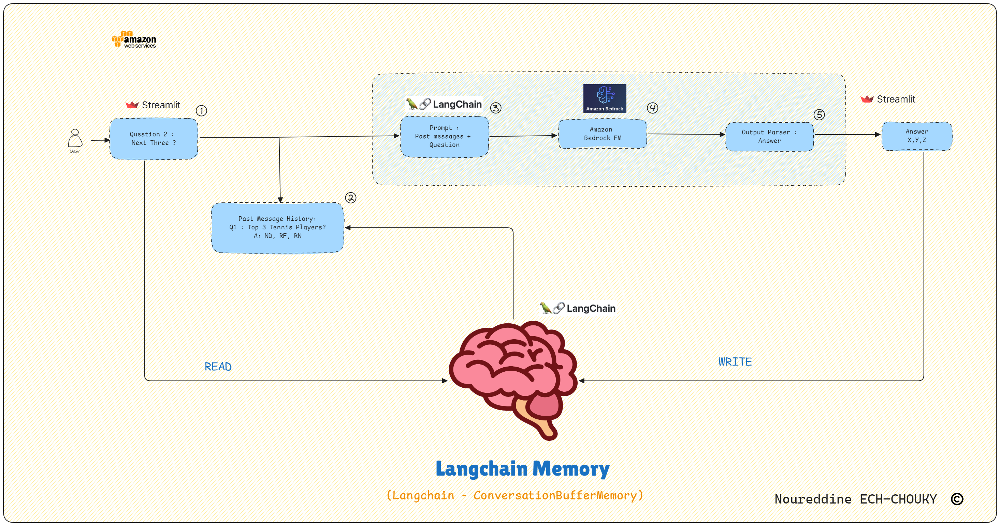

# BedRock Chatbot AI 🤖

BedRock Chatbot AI is an advanced conversational AI application that leverages Amazon Bedrock, LangChain, and Streamlit to provide an intelligent and interactive chatbot experience. This project demonstrates the seamless integration of state-of-the-art language models with a user-friendly interface, showcasing the potential of AI-driven conversations in various domains.

## Architecture 🏗️



1. **User**: Initiates interaction through the Streamlit web interface.
2. **Streamlit Frontend**: Handles user input and displays responses.
3. **LangChain**: Manages conversation flow and memory.
4. **Amazon Bedrock**: Utilizes the Claude v2 Foundation Model to generate responses.
5. **Conversation Memory**: Stores and retrieves conversation history for context-aware interactions.

## Features ✨

- **Amazon Bedrock Integration**: Harnesses the power of Claude v2 for natural language understanding and generation.
- **LangChain Framework**: Enhances contextual understanding and manages conversation memory.
- **Streamlit Frontend**: Provides an intuitive and responsive user interface for real-time interaction.
- **Scalable Architecture**: Designed for easy expansion and customization.
- **Conversation Memory**: Implements history retention for more coherent interactions.

## Prerequisites 📋

- AWS account with access to Amazon Bedrock
- Python 3.7+
- VS Code (recommended)
- Anaconda (recommended)
- AWS CLI configured with appropriate permissions

## Setup 🚀

### 1. Clone the Repository

```bash
git clone https://github.com/yourusername/bedrock-chatbot-ai.git
cd bedrock-chatbot-ai
```

### 2. Set Up Virtual Environment

```bash
python -m venv venv
source venv/bin/activate  # On Windows, use: venv\Scripts\activate
```

### 3. Install Dependencies

```bash
pip install -r requirements.txt
```

### 4. Configure AWS Credentials

Ensure your AWS CLI is configured with the correct credentials and region:

```bash
aws configure
```

### 5. Run the Application

```bash
streamlit run chatbot_frontend.py
```

## Usage 📦

1. Start the application using the command above.
2. Open your web browser and navigate to the provided local URL (usually `http://localhost:8501`).
3. Type your message in the chat input and press Enter to interact with the chatbot.
4. The chatbot will respond based on the conversation context and your input.

## Project Structure 📁

- `chatbot_backend.py`: Core logic for AI model integration and conversation management
- `chatbot_frontend.py`: Streamlit-based user interface
- `requirements.txt`: List of Python dependencies

## Generative AI with Bedrock: Step by Step Guide 🔍

1. **Create an IAM Role**: Ensure the role has `AmazonBedrockFullAccess` policy attached.
2. **Increase Lambda Timeout**: Set an appropriate timeout for your Lambda function.
3. **Code for Bedrock Invocation**: Use boto3 to interact with Amazon Bedrock.
4. **Configure Test Event**: Use a JSON payload to test your function.

```json
{ "prompt": "Your test prompt here" }
```

5. **Create a REST API**: Use API Gateway to expose your Lambda function.
6. **Deploy and Test**: Deploy your API and test using tools like Postman or the API Gateway console.

## Contributing 🤝

We welcome contributions to the BedRock Chatbot AI project! Please follow these steps:

1. Fork the repository.
2. Create a new branch (`git checkout -b feature/your-feature`).
3. Make your changes and commit them (`git commit -am 'Add new feature'`).
4. Push to your branch (`git push origin feature/your-feature`).
5. Create a new Pull Request.

## License 📄

This project is licensed under the MIT License - see the [LICENSE](LICENSE) file for details.

## Acknowledgments 🙏

- Amazon Web Services for providing the Bedrock platform
- LangChain community for their excellent framework
- Streamlit team for their intuitive app development tools

---

Developed with ❤️ by Noureddine E.